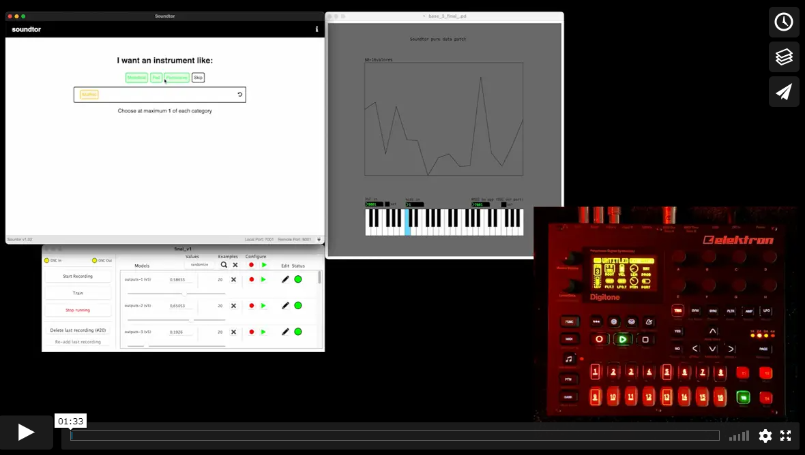
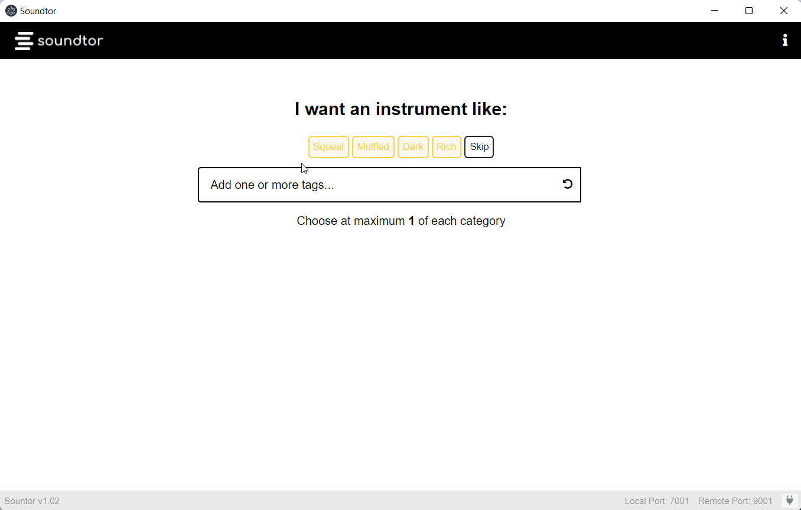

### Available for Windows x86/x64 and Mac x64 and arm64
 **Soundtor** is a three layer system, that generates a playable MIDI instrument based on the user's inputs choices. Using a GUI (Electron app) the user chooses the desired sound properties from a set of predefined keywords. The subsequent layer (Wekinator app), it's pre-trained ML model translates the set of tags and outputs them into a larger set of data understandable by the final layer (Pure Data patch). This data patch manipulates sound waves’ properties such as pitch frequency, decay and allows the user to play with the generated soundwave by clicking on a virtual keyboard or through a MIDI input. 
 The connection between all layers are accomplished with Open Sound Control (OSC) through a UDP socket (Local Port 7001, Remote Port 8001) 

# Demo

# Instructions
The three processes (Electron app, Wekinator, Pure Data patch) must be initialized before manipulating the system. On the GUI (Electron) app, the user is presented with the home/main screen after the app is loaded, a white bar is the main focus on the screen, with the keywords (tags) above it. The user can then choose by selecting one or skip the category. The user must choose one of each color, adding up to a maximum of 5 and a minimum of 1 of each tag. Alternatively, by clicking on the “undo” button, the last chosen tag returns to the top and is removed from the input.

When the user chooses all the categories, the “Make it” button appears that is followed by a pentagram graph, as well as 5 different sliders, corresponding to the categories previously chosen. These sliders allow the user to freely adjust each category's values, generated by the corresponding tags.
In the Pure Data patch, set the values for booth OSC ports (from Wekinator - default: 9001; and to App default: 7001), click “set” for each to connect. 
User can play keyboard notes with the resulting sound either by clicking on each note or by playing through MIDI input. Select the desired MIDI channel in the MIDI box.
Additionally, the user can manipulate the values of the GUI sliders also by MIDI control change (controller number: fadder 1: 70, fadder 2:  71, fadder 3: 72, fadder 4: 73 and fadder 5: 74).

# Future Development

* Users can write the desired description, using machine learning the text is converted to values. Any text to describe, no limit of parameters.
* Incorporation of Pura Data patch inside the app;
* VST version of the project;
* MIDI control values increment and decrement values from faders (when using external MIDI controller, value is not updated when changing the patch, so when you change the patch and user controller, value starts from the position set to it before.
